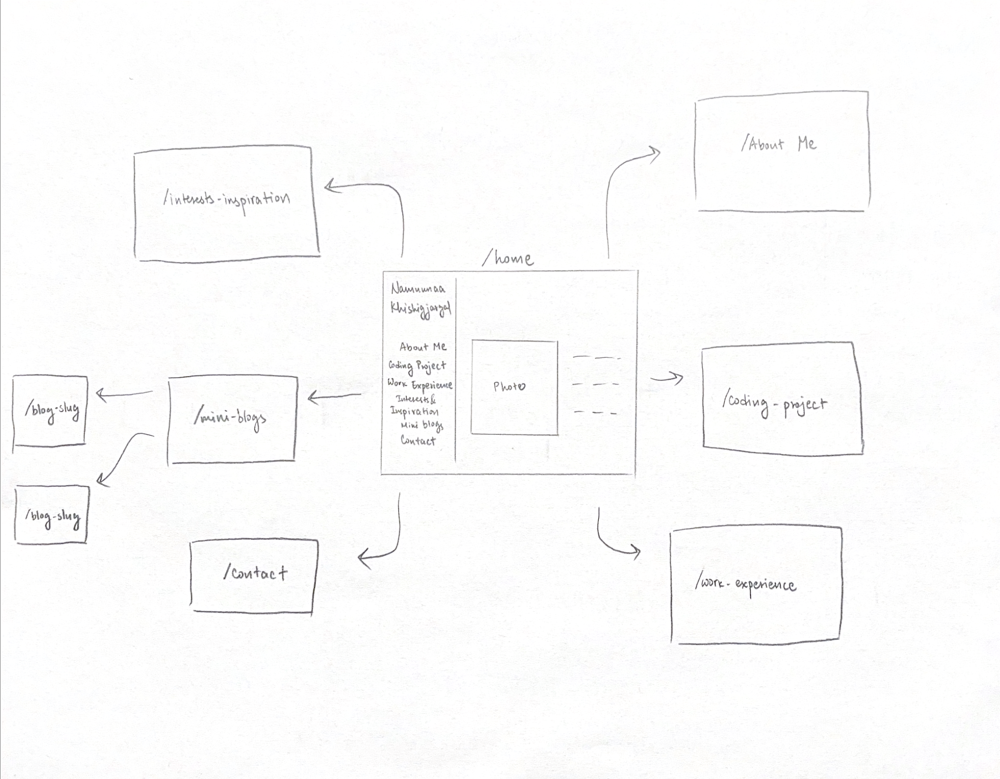

# Portfolio Website

## Overview

This project is a personal portfolio website showcasing my skills, projects, and experiences. The backend will be built with Node.js, Express.js, and MongoDB, while the frontend will use CSS. This site will serve as an online resume for potential employers.

## Data Model

The application will store Projects, Blog Posts, Contact Messages

* Each project will have details such as title, description, technologies used, and links.
* Each blog post will contain a title, content, and timestamp.
* Contact messages will store inquiries from visitors.

An Example Project:

```javascript
{
  title: "My Awesome Project",
  description: "A web application built with React and Node.js",
  technologies: ["React", "Node.js", "MongoDB"],
  githubLink: "https://github.com/username/my-awesome-project",
  liveDemo: "https://my-awesome-project.com",
  image: "https://my-awesome-project.com/project-image.jpg",
}
```

An Example Blog Post:

```javascript
{
  title: "Why I Love Fashion & Tech",
  content: "Fashion is more than just clothing. It's a form of self-expression...",
  createdAt: // time
}
```

```javascript
{
  name: "John Doe",
  email: "johndoe@example.com",
  message: "I love your portfolio!",
  createdAt: // timestamp
}
```

## [Link to Commented First Draft Schema](db.mjs) 

## Wireframes

/home - home page


/about-me - page for about me section


/coding-project - page for coding project section


/work-experience 


/interests&inspiration 


/mini-blogs


/contact


## Site map



## User Stories or Use Cases

1. As a visitor, I get to learn more about Namuunaa’s background, skills, and experience so that I can evaluate whether she is a good fit for potential opportunities.

## Research Topics

* (4 points) MongoDB with Mongoose ODM
	•	I'll use MongoDB as the database and Mongoose for schema modeling and database interactions.
	•	Schema includes Projects, Blog Posts, and Contact Messages.

* (3 points) Dynamic Frontend with Handlebars
	•	I'll use handlebars as templating engine to dynamically generate HTML content for projects and blog posts so that pages update dynamically when new content is added to the database.

* I will add more later.

## [Link to Initial Main Project File](app.mjs) 

## Annotations / References Used

(__TODO__: list any tutorials/references/etc. that you've based your code off of)
